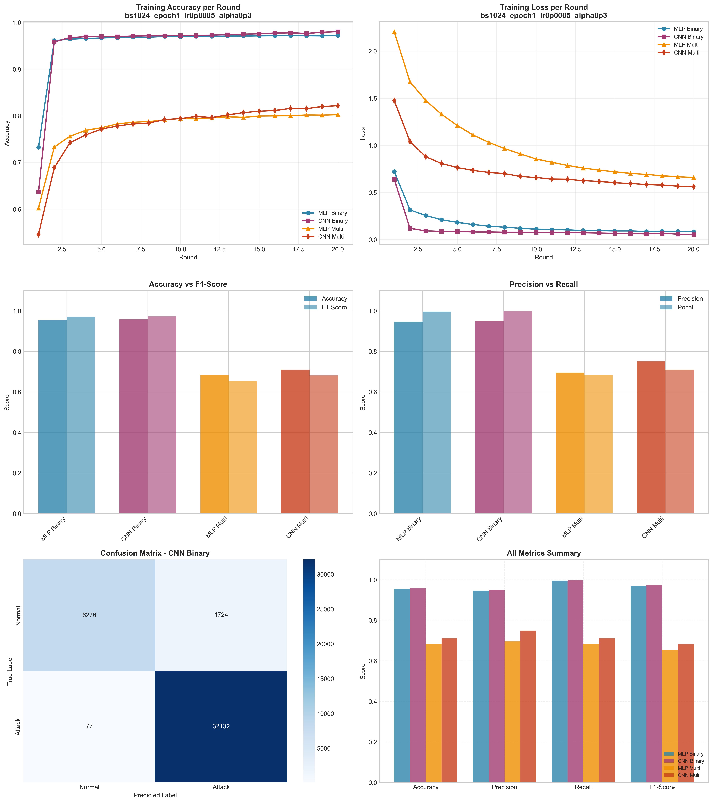

# Experiment Report: bs1024_epoch1_lr0p0005_alpha0p3

**Date**: 2025-12-10 10:52:48

## Hyperparameters

- **Batch Size**: 1024
- **Local Epochs**: 1
- **Learning Rate**: 0.0005
- **Alpha (Dirichlet)**: 0.3
- **Number of Rounds**: 20
- **Number of Clients**: 5

## Results Summary

### Binary Classification

| Model | Accuracy | Precision | Recall | F1-Score | AUC-ROC |
|-------|----------|-----------|--------|----------|----------|
| MLP Binary | 0.9539 | 0.9465 | 0.9959 | 0.9706 | 0.9927 |
| CNN Binary | 0.9573 | 0.9491 | 0.9976 | 0.9727 | 0.9960 |

### Multi-class Classification

| Model | Accuracy | Precision | Recall | F1-Score | AUC-ROC |
|-------|----------|-----------|--------|----------|----------|
| MLP Multi | 0.6834 | 0.6958 | 0.6834 | 0.6536 | 0.9537 |
| CNN Multi | 0.7104 | 0.7498 | 0.7104 | 0.6814 | 0.9704 |

## Training Time

- **MLP Binary**: Total=55.69s, Avg/Round=2.76s
- **CNN Binary**: Total=156.50s, Avg/Round=7.74s
- **MLP Multi**: Total=75.02s, Avg/Round=3.70s
- **CNN Multi**: Total=302.36s, Avg/Round=14.97s

## Visualizations

## Files Generated

- `results_summary.json` - Metrics in JSON format
- `models/` - Saved trained models
- `plots/` - Visualization plots
