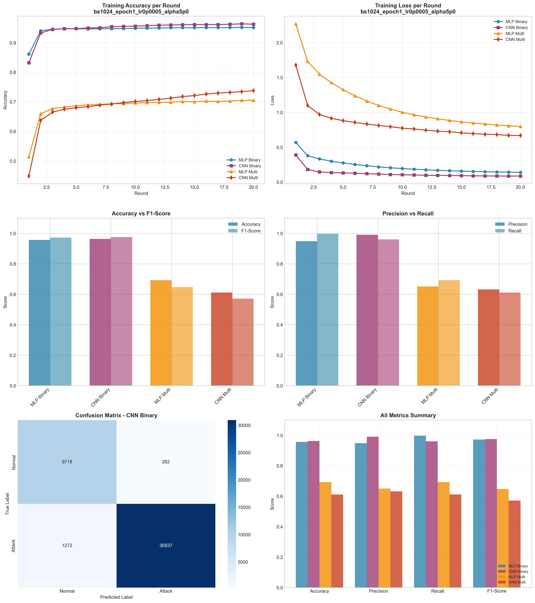

# Experiment Report: bs1024_epoch1_lr0p0005_alpha5p0

**Date**: 2025-12-10 11:03:03

## Hyperparameters

- **Batch Size**: 1024
- **Local Epochs**: 1
- **Learning Rate**: 0.0005
- **Alpha (Dirichlet)**: 5.0
- **Number of Rounds**: 20
- **Number of Clients**: 5

## Results Summary

### Binary Classification

| Model | Accuracy | Precision | Recall | F1-Score | AUC-ROC |
|-------|----------|-----------|--------|----------|----------|
| MLP Binary | 0.9569 | 0.9486 | 0.9975 | 0.9725 | 0.9929 |
| CNN Binary | 0.9632 | 0.9910 | 0.9605 | 0.9755 | 0.9946 |

### Multi-class Classification

| Model | Accuracy | Precision | Recall | F1-Score | AUC-ROC |
|-------|----------|-----------|--------|----------|----------|
| MLP Multi | 0.6926 | 0.6508 | 0.6926 | 0.6473 | 0.9524 |
| CNN Multi | 0.6115 | 0.6323 | 0.6115 | 0.5717 | 0.9394 |

## Training Time

- **MLP Binary**: Total=54.14s, Avg/Round=2.67s
- **CNN Binary**: Total=163.42s, Avg/Round=8.11s
- **MLP Multi**: Total=72.79s, Avg/Round=3.59s
- **CNN Multi**: Total=307.36s, Avg/Round=15.21s

## Visualizations

## Files Generated

- `results_summary.json` - Metrics in JSON format
- `models/` - Saved trained models
- `plots/` - Visualization plots
