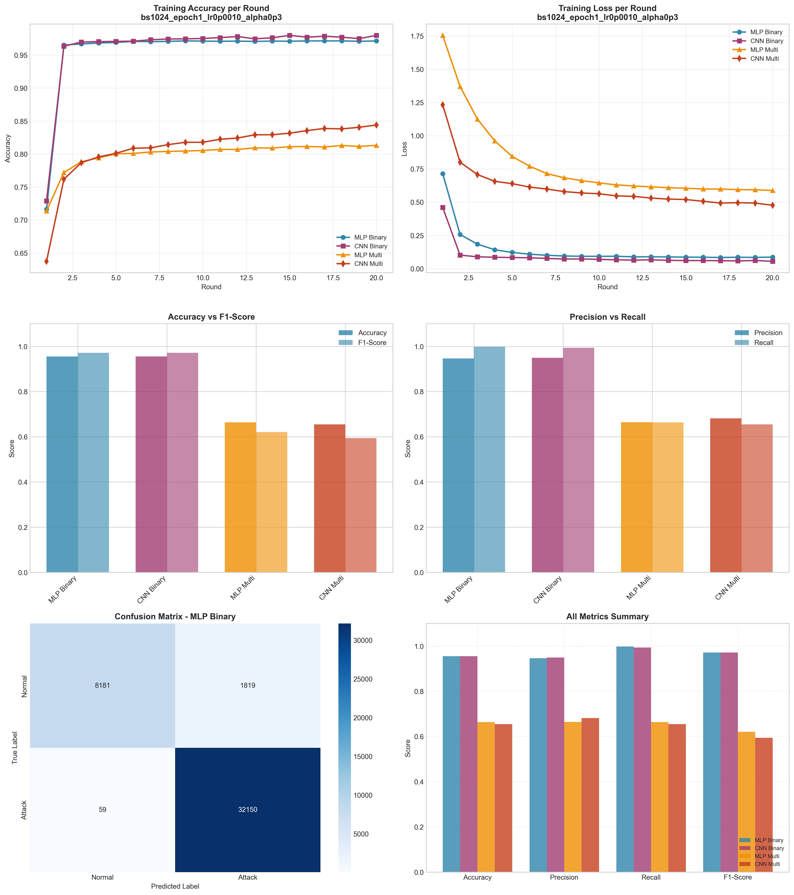

# Experiment Report: bs1024_epoch1_lr0p0010_alpha0p3

**Date**: 2025-12-10 10:32:17

## Hyperparameters

- **Batch Size**: 1024
- **Local Epochs**: 1
- **Learning Rate**: 0.001
- **Alpha (Dirichlet)**: 0.3
- **Number of Rounds**: 20
- **Number of Clients**: 5

## Results Summary

### Binary Classification

| Model | Accuracy | Precision | Recall | F1-Score | AUC-ROC |
|-------|----------|-----------|--------|----------|----------|
| MLP Binary | 0.9555 | 0.9465 | 0.9982 | 0.9716 | 0.9926 |
| CNN Binary | 0.9553 | 0.9498 | 0.9940 | 0.9714 | 0.9945 |

### Multi-class Classification

| Model | Accuracy | Precision | Recall | F1-Score | AUC-ROC |
|-------|----------|-----------|--------|----------|----------|
| MLP Multi | 0.6635 | 0.6642 | 0.6635 | 0.6206 | 0.9588 |
| CNN Multi | 0.6547 | 0.6813 | 0.6547 | 0.5941 | 0.9537 |

## Training Time

- **MLP Binary**: Total=55.80s, Avg/Round=2.76s
- **CNN Binary**: Total=158.77s, Avg/Round=7.88s
- **MLP Multi**: Total=73.54s, Avg/Round=3.64s
- **CNN Multi**: Total=295.47s, Avg/Round=14.66s

## Visualizations

## Files Generated

- `results_summary.json` - Metrics in JSON format
- `models/` - Saved trained models
- `plots/` - Visualization plots
