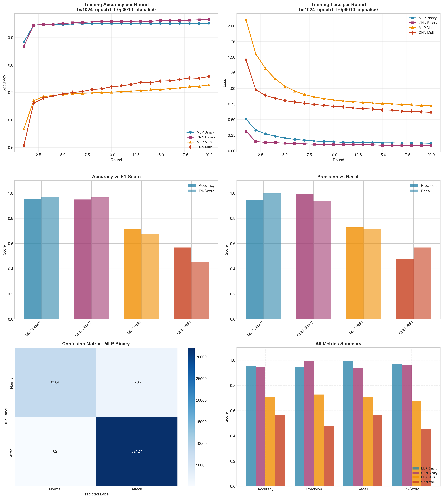

# Experiment Report: bs1024_epoch1_lr0p0010_alpha5p0

**Date**: 2025-12-10 10:42:41

## Hyperparameters

- **Batch Size**: 1024
- **Local Epochs**: 1
- **Learning Rate**: 0.001
- **Alpha (Dirichlet)**: 5.0
- **Number of Rounds**: 20
- **Number of Clients**: 5

## Results Summary

### Binary Classification

| Model | Accuracy | Precision | Recall | F1-Score | AUC-ROC |
|-------|----------|-----------|--------|----------|----------|
| MLP Binary | 0.9569 | 0.9487 | 0.9975 | 0.9725 | 0.9936 |
| CNN Binary | 0.9492 | 0.9929 | 0.9402 | 0.9658 | 0.9941 |

### Multi-class Classification

| Model | Accuracy | Precision | Recall | F1-Score | AUC-ROC |
|-------|----------|-----------|--------|----------|----------|
| MLP Multi | 0.7119 | 0.7281 | 0.7119 | 0.6782 | 0.9599 |
| CNN Multi | 0.5681 | 0.4754 | 0.5681 | 0.4538 | 0.9336 |

## Training Time

- **MLP Binary**: Total=54.59s, Avg/Round=2.70s
- **CNN Binary**: Total=167.84s, Avg/Round=8.31s
- **MLP Multi**: Total=72.22s, Avg/Round=3.56s
- **CNN Multi**: Total=311.69s, Avg/Round=15.43s

## Visualizations

## Files Generated

- `results_summary.json` - Metrics in JSON format
- `models/` - Saved trained models
- `plots/` - Visualization plots
