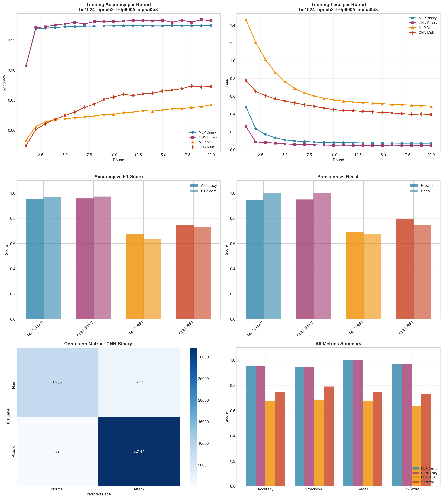

# Experiment Report: bs1024_epoch2_lr0p0005_alpha0p3

**Date**: 2025-12-10 11:48:14

## Hyperparameters

- **Batch Size**: 1024
- **Local Epochs**: 2
- **Learning Rate**: 0.0005
- **Alpha (Dirichlet)**: 0.3
- **Number of Rounds**: 20
- **Number of Clients**: 5

## Results Summary

### Binary Classification

| Model | Accuracy | Precision | Recall | F1-Score | AUC-ROC |
|-------|----------|-----------|--------|----------|----------|
| MLP Binary | 0.9556 | 0.9466 | 0.9981 | 0.9717 | 0.9932 |
| CNN Binary | 0.9580 | 0.9494 | 0.9981 | 0.9731 | 0.9974 |

### Multi-class Classification

| Model | Accuracy | Precision | Recall | F1-Score | AUC-ROC |
|-------|----------|-----------|--------|----------|----------|
| MLP Multi | 0.6762 | 0.6880 | 0.6762 | 0.6384 | 0.9632 |
| CNN Multi | 0.7475 | 0.7917 | 0.7475 | 0.7317 | 0.9786 |

## Training Time

- **MLP Binary**: Total=69.63s, Avg/Round=3.45s
- **CNN Binary**: Total=234.89s, Avg/Round=11.67s
- **MLP Multi**: Total=105.86s, Avg/Round=5.24s
- **CNN Multi**: Total=476.32s, Avg/Round=23.66s

## Visualizations

## Files Generated

- `results_summary.json` - Metrics in JSON format
- `models/` - Saved trained models
- `plots/` - Visualization plots
