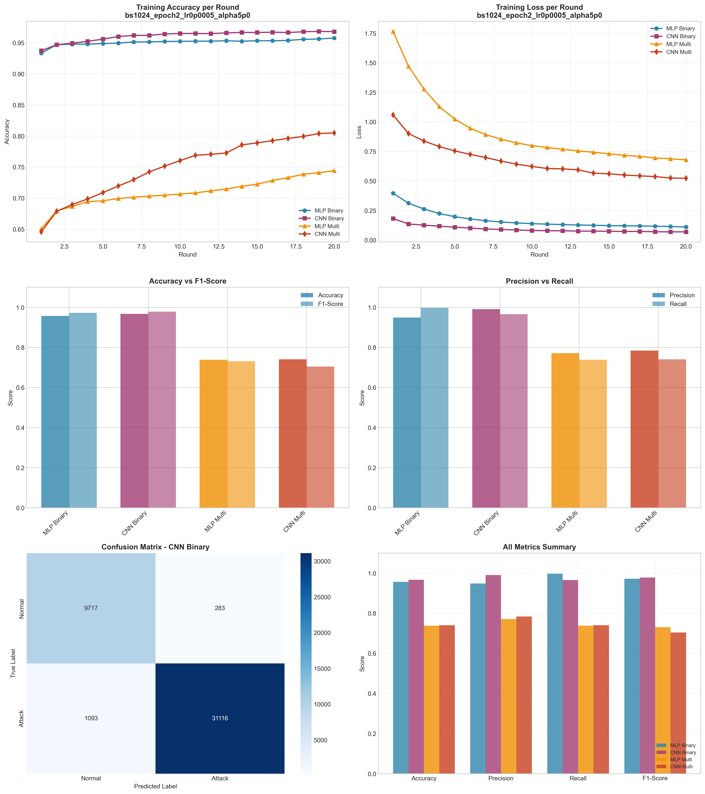

# Experiment Report: bs1024_epoch2_lr0p0005_alpha5p0

**Date**: 2025-12-10 12:03:51

## Hyperparameters

- **Batch Size**: 1024
- **Local Epochs**: 2
- **Learning Rate**: 0.0005
- **Alpha (Dirichlet)**: 5.0
- **Number of Rounds**: 20
- **Number of Clients**: 5

## Results Summary

### Binary Classification

| Model | Accuracy | Precision | Recall | F1-Score | AUC-ROC |
|-------|----------|-----------|--------|----------|----------|
| MLP Binary | 0.9570 | 0.9487 | 0.9975 | 0.9725 | 0.9942 |
| CNN Binary | 0.9674 | 0.9910 | 0.9661 | 0.9784 | 0.9968 |

### Multi-class Classification

| Model | Accuracy | Precision | Recall | F1-Score | AUC-ROC |
|-------|----------|-----------|--------|----------|----------|
| MLP Multi | 0.7383 | 0.7717 | 0.7383 | 0.7312 | 0.9633 |
| CNN Multi | 0.7405 | 0.7842 | 0.7405 | 0.7040 | 0.9758 |

## Training Time

- **MLP Binary**: Total=67.35s, Avg/Round=3.34s
- **CNN Binary**: Total=241.52s, Avg/Round=11.99s
- **MLP Multi**: Total=100.99s, Avg/Round=5.01s
- **CNN Multi**: Total=509.70s, Avg/Round=25.33s

## Visualizations

## Files Generated

- `results_summary.json` - Metrics in JSON format
- `models/` - Saved trained models
- `plots/` - Visualization plots
