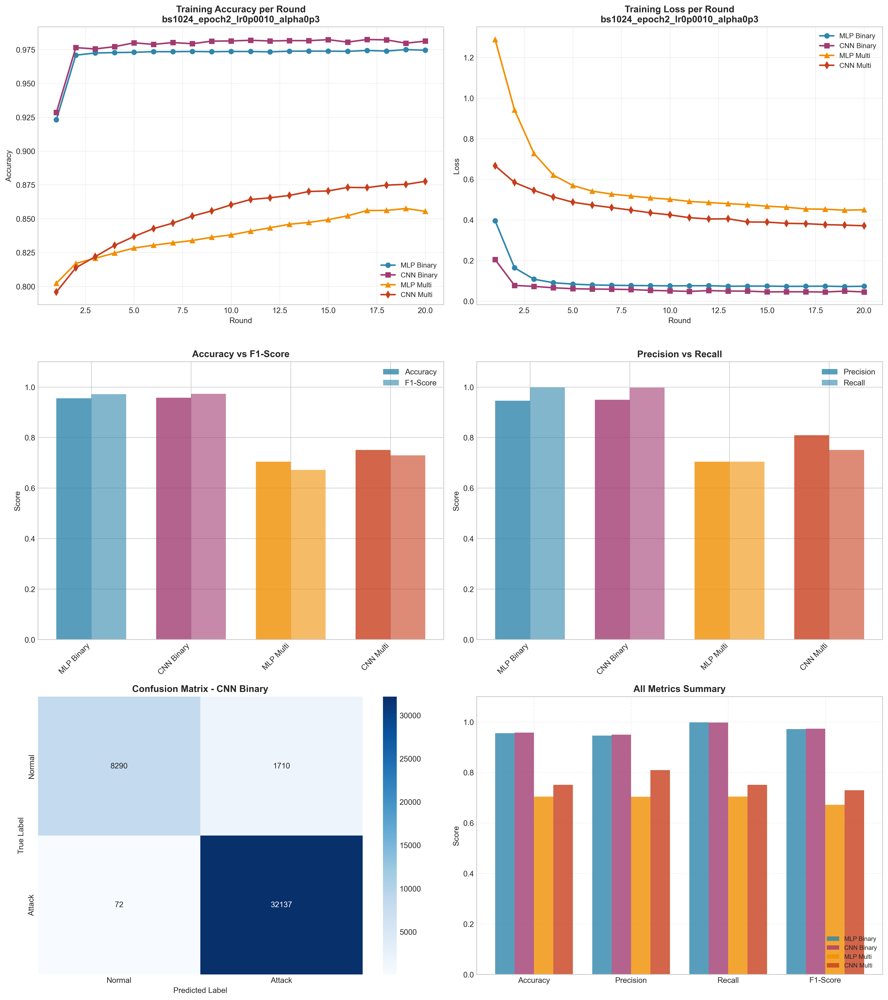

# Experiment Report: bs1024_epoch2_lr0p0010_alpha0p3

**Date**: 2025-12-10 11:17:57

## Hyperparameters

- **Batch Size**: 1024
- **Local Epochs**: 2
- **Learning Rate**: 0.001
- **Alpha (Dirichlet)**: 0.3
- **Number of Rounds**: 20
- **Number of Clients**: 5

## Results Summary

### Binary Classification

| Model | Accuracy | Precision | Recall | F1-Score | AUC-ROC |
|-------|----------|-----------|--------|----------|----------|
| MLP Binary | 0.9553 | 0.9460 | 0.9984 | 0.9715 | 0.9935 |
| CNN Binary | 0.9578 | 0.9495 | 0.9978 | 0.9730 | 0.9971 |

### Multi-class Classification

| Model | Accuracy | Precision | Recall | F1-Score | AUC-ROC |
|-------|----------|-----------|--------|----------|----------|
| MLP Multi | 0.7042 | 0.7040 | 0.7042 | 0.6720 | 0.9639 |
| CNN Multi | 0.7511 | 0.8089 | 0.7511 | 0.7296 | 0.9837 |

## Training Time

- **MLP Binary**: Total=69.54s, Avg/Round=3.45s
- **CNN Binary**: Total=227.41s, Avg/Round=11.31s
- **MLP Multi**: Total=103.24s, Avg/Round=5.13s
- **CNN Multi**: Total=477.39s, Avg/Round=23.76s

## Visualizations

## Files Generated

- `results_summary.json` - Metrics in JSON format
- `models/` - Saved trained models
- `plots/` - Visualization plots
