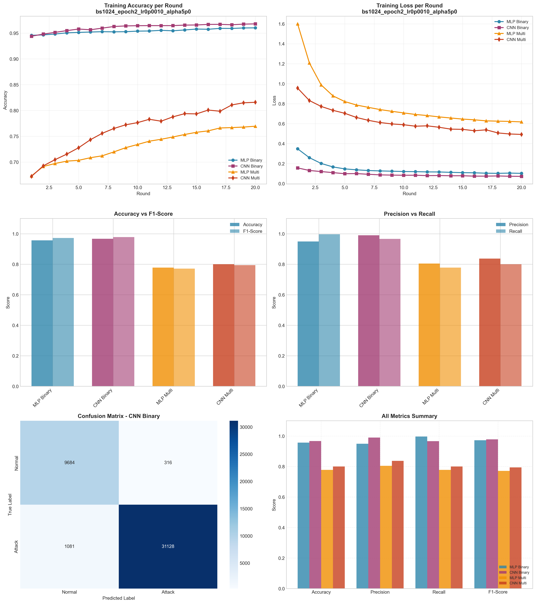

# Experiment Report: bs1024_epoch2_lr0p0010_alpha5p0

**Date**: 2025-12-10 11:33:10

## Hyperparameters

- **Batch Size**: 1024
- **Local Epochs**: 2
- **Learning Rate**: 0.001
- **Alpha (Dirichlet)**: 5.0
- **Number of Rounds**: 20
- **Number of Clients**: 5

## Results Summary

### Binary Classification

| Model | Accuracy | Precision | Recall | F1-Score | AUC-ROC |
|-------|----------|-----------|--------|----------|----------|
| MLP Binary | 0.9569 | 0.9492 | 0.9968 | 0.9724 | 0.9948 |
| CNN Binary | 0.9669 | 0.9900 | 0.9664 | 0.9781 | 0.9964 |

### Multi-class Classification

| Model | Accuracy | Precision | Recall | F1-Score | AUC-ROC |
|-------|----------|-----------|--------|----------|----------|
| MLP Multi | 0.7779 | 0.8044 | 0.7779 | 0.7716 | 0.9801 |
| CNN Multi | 0.8005 | 0.8374 | 0.8005 | 0.7946 | 0.9825 |

## Training Time

- **MLP Binary**: Total=65.90s, Avg/Round=3.27s
- **CNN Binary**: Total=232.81s, Avg/Round=11.55s
- **MLP Multi**: Total=102.81s, Avg/Round=5.10s
- **CNN Multi**: Total=494.09s, Avg/Round=24.55s

## Visualizations

## Files Generated

- `results_summary.json` - Metrics in JSON format
- `models/` - Saved trained models
- `plots/` - Visualization plots
