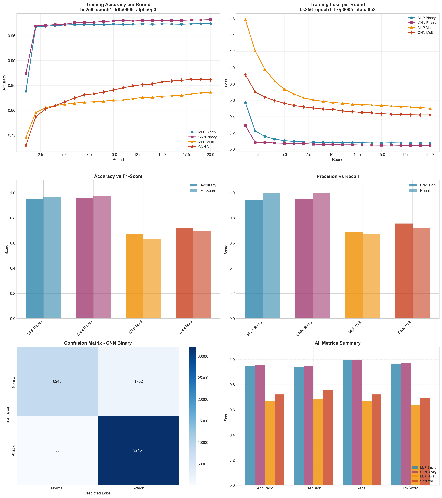

# Experiment Report: bs256_epoch1_lr0p0005_alpha0p3

**Date**: 2025-12-10 07:33:42

## Hyperparameters

- **Batch Size**: 256
- **Local Epochs**: 1
- **Learning Rate**: 0.0005
- **Alpha (Dirichlet)**: 0.3
- **Number of Rounds**: 20
- **Number of Clients**: 5

## Results Summary

### Binary Classification

| Model | Accuracy | Precision | Recall | F1-Score | AUC-ROC |
|-------|----------|-----------|--------|----------|----------|
| MLP Binary | 0.9500 | 0.9391 | 0.9992 | 0.9682 | 0.9933 |
| CNN Binary | 0.9572 | 0.9483 | 0.9983 | 0.9727 | 0.9967 |

### Multi-class Classification

| Model | Accuracy | Precision | Recall | F1-Score | AUC-ROC |
|-------|----------|-----------|--------|----------|----------|
| MLP Multi | 0.6716 | 0.6857 | 0.6716 | 0.6349 | 0.9648 |
| CNN Multi | 0.7223 | 0.7551 | 0.7223 | 0.6973 | 0.9690 |

## Training Time

- **MLP Binary**: Total=69.76s, Avg/Round=3.44s
- **CNN Binary**: Total=149.82s, Avg/Round=7.41s
- **MLP Multi**: Total=92.41s, Avg/Round=4.57s
- **CNN Multi**: Total=276.57s, Avg/Round=13.68s

## Visualizations

## Files Generated

- `results_summary.json` - Metrics in JSON format
- `models/` - Saved trained models
- `plots/` - Visualization plots
