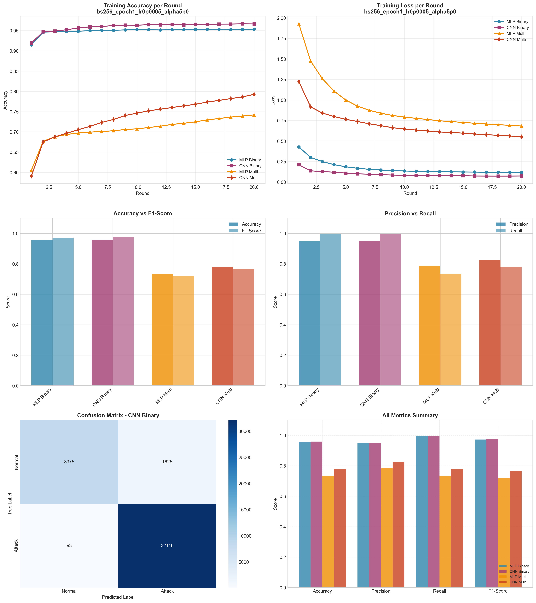

# Experiment Report: bs256_epoch1_lr0p0005_alpha5p0

**Date**: 2025-12-10 07:44:04

## Hyperparameters

- **Batch Size**: 256
- **Local Epochs**: 1
- **Learning Rate**: 0.0005
- **Alpha (Dirichlet)**: 5.0
- **Number of Rounds**: 20
- **Number of Clients**: 5

## Results Summary

### Binary Classification

| Model | Accuracy | Precision | Recall | F1-Score | AUC-ROC |
|-------|----------|-----------|--------|----------|----------|
| MLP Binary | 0.9568 | 0.9486 | 0.9974 | 0.9724 | 0.9935 |
| CNN Binary | 0.9593 | 0.9518 | 0.9971 | 0.9739 | 0.9645 |

### Multi-class Classification

| Model | Accuracy | Precision | Recall | F1-Score | AUC-ROC |
|-------|----------|-----------|--------|----------|----------|
| MLP Multi | 0.7345 | 0.7856 | 0.7345 | 0.7181 | 0.9763 |
| CNN Multi | 0.7807 | 0.8257 | 0.7807 | 0.7637 | 0.9804 |

## Training Time

- **MLP Binary**: Total=65.05s, Avg/Round=3.21s
- **CNN Binary**: Total=144.50s, Avg/Round=7.16s
- **MLP Multi**: Total=98.99s, Avg/Round=4.90s
- **CNN Multi**: Total=296.18s, Avg/Round=14.66s

## Visualizations

## Files Generated

- `results_summary.json` - Metrics in JSON format
- `models/` - Saved trained models
- `plots/` - Visualization plots
