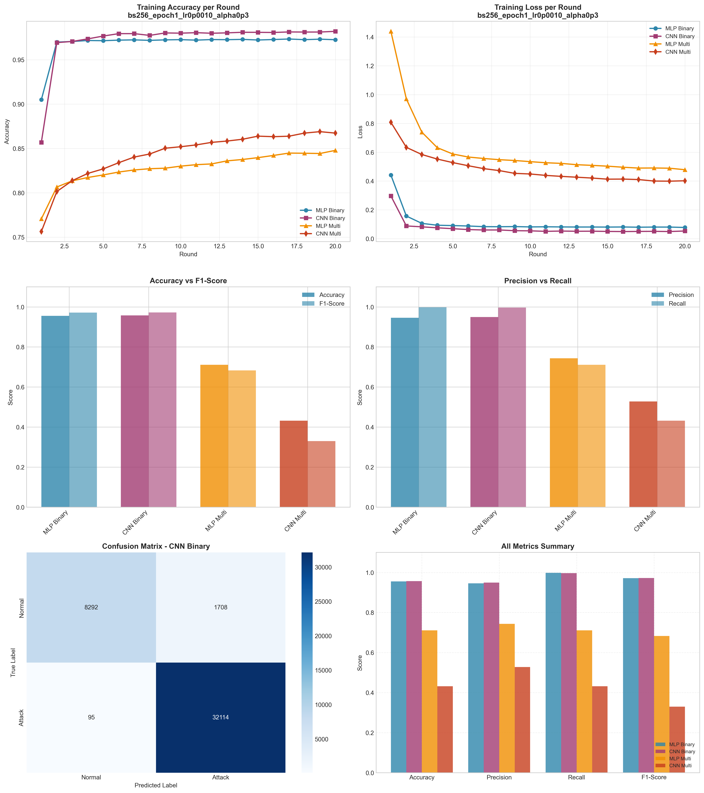

# Experiment Report: bs256_epoch1_lr0p0010_alpha0p3

**Date**: 2025-12-10 07:13:13

## Hyperparameters

- **Batch Size**: 256
- **Local Epochs**: 1
- **Learning Rate**: 0.001
- **Alpha (Dirichlet)**: 0.3
- **Number of Rounds**: 20
- **Number of Clients**: 5

## Results Summary

### Binary Classification

| Model | Accuracy | Precision | Recall | F1-Score | AUC-ROC |
|-------|----------|-----------|--------|----------|----------|
| MLP Binary | 0.9552 | 0.9461 | 0.9981 | 0.9714 | 0.9928 |
| CNN Binary | 0.9573 | 0.9495 | 0.9971 | 0.9727 | 0.9918 |

### Multi-class Classification

| Model | Accuracy | Precision | Recall | F1-Score | AUC-ROC |
|-------|----------|-----------|--------|----------|----------|
| MLP Multi | 0.7111 | 0.7435 | 0.7111 | 0.6831 | 0.9643 |
| CNN Multi | 0.4319 | 0.5280 | 0.4319 | 0.3299 | 0.8943 |

## Training Time

- **MLP Binary**: Total=69.57s, Avg/Round=3.43s
- **CNN Binary**: Total=154.10s, Avg/Round=7.63s
- **MLP Multi**: Total=92.61s, Avg/Round=4.58s
- **CNN Multi**: Total=282.80s, Avg/Round=14.03s

## Visualizations

## Files Generated

- `results_summary.json` - Metrics in JSON format
- `models/` - Saved trained models
- `plots/` - Visualization plots
