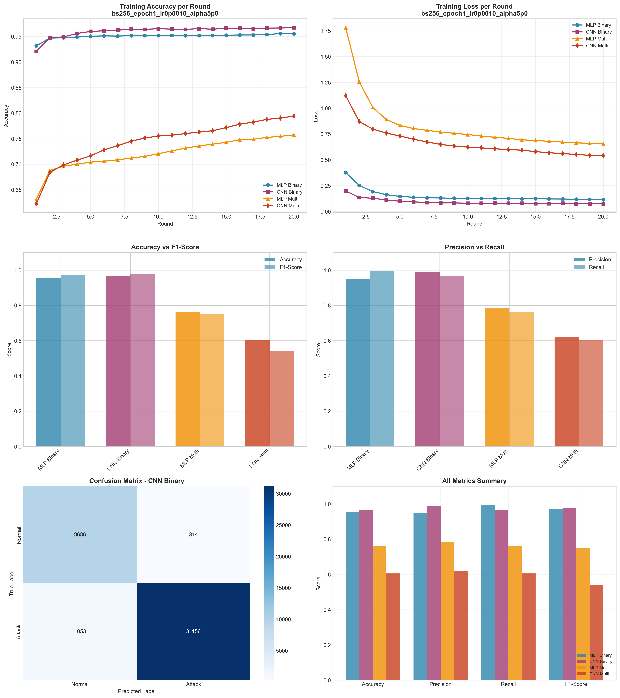

# Experiment Report: bs256_epoch1_lr0p0010_alpha5p0

**Date**: 2025-12-10 07:23:36

## Hyperparameters

- **Batch Size**: 256
- **Local Epochs**: 1
- **Learning Rate**: 0.001
- **Alpha (Dirichlet)**: 5.0
- **Number of Rounds**: 20
- **Number of Clients**: 5

## Results Summary

### Binary Classification

| Model | Accuracy | Precision | Recall | F1-Score | AUC-ROC |
|-------|----------|-----------|--------|----------|----------|
| MLP Binary | 0.9563 | 0.9490 | 0.9962 | 0.9720 | 0.9936 |
| CNN Binary | 0.9676 | 0.9900 | 0.9673 | 0.9785 | 0.9970 |

### Multi-class Classification

| Model | Accuracy | Precision | Recall | F1-Score | AUC-ROC |
|-------|----------|-----------|--------|----------|----------|
| MLP Multi | 0.7621 | 0.7831 | 0.7621 | 0.7508 | 0.9781 |
| CNN Multi | 0.6057 | 0.6187 | 0.6057 | 0.5389 | 0.9104 |

## Training Time

- **MLP Binary**: Total=66.39s, Avg/Round=3.28s
- **CNN Binary**: Total=147.67s, Avg/Round=7.31s
- **MLP Multi**: Total=94.23s, Avg/Round=4.66s
- **CNN Multi**: Total=298.12s, Avg/Round=14.75s

## Visualizations

## Files Generated

- `results_summary.json` - Metrics in JSON format
- `models/` - Saved trained models
- `plots/` - Visualization plots
