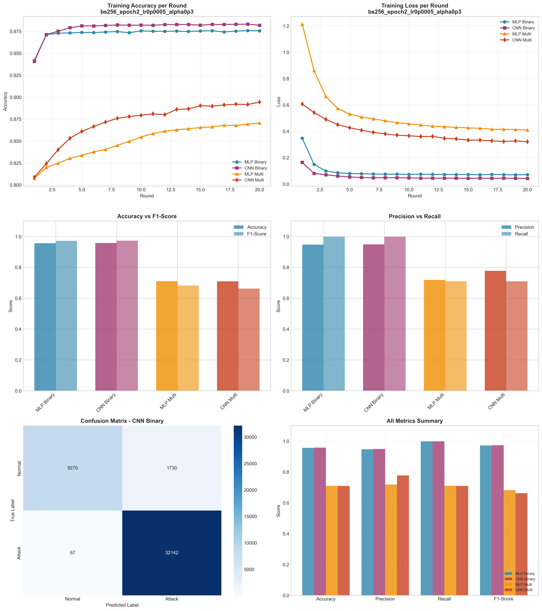

# Experiment Report: bs256_epoch2_lr0p0005_alpha0p3

**Date**: 2025-12-10 08:28:06

## Hyperparameters

- **Batch Size**: 256
- **Local Epochs**: 2
- **Learning Rate**: 0.0005
- **Alpha (Dirichlet)**: 0.3
- **Number of Rounds**: 20
- **Number of Clients**: 5

## Results Summary

### Binary Classification

| Model | Accuracy | Precision | Recall | F1-Score | AUC-ROC |
|-------|----------|-----------|--------|----------|----------|
| MLP Binary | 0.9561 | 0.9473 | 0.9980 | 0.9720 | 0.9935 |
| CNN Binary | 0.9574 | 0.9489 | 0.9979 | 0.9728 | 0.9975 |

### Multi-class Classification

| Model | Accuracy | Precision | Recall | F1-Score | AUC-ROC |
|-------|----------|-----------|--------|----------|----------|
| MLP Multi | 0.7102 | 0.7187 | 0.7102 | 0.6825 | 0.9639 |
| CNN Multi | 0.7098 | 0.7777 | 0.7098 | 0.6626 | 0.9747 |

## Training Time

- **MLP Binary**: Total=92.09s, Avg/Round=4.57s
- **CNN Binary**: Total=223.87s, Avg/Round=11.11s
- **MLP Multi**: Total=136.05s, Avg/Round=6.75s
- **CNN Multi**: Total=415.16s, Avg/Round=20.60s

## Visualizations

## Files Generated

- `results_summary.json` - Metrics in JSON format
- `models/` - Saved trained models
- `plots/` - Visualization plots
