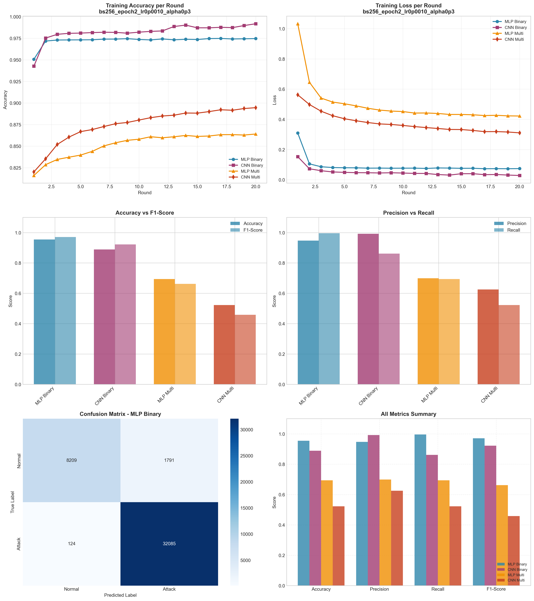

# Experiment Report: bs256_epoch2_lr0p0010_alpha0p3

**Date**: 2025-12-10 07:59:11

## Hyperparameters

- **Batch Size**: 256
- **Local Epochs**: 2
- **Learning Rate**: 0.001
- **Alpha (Dirichlet)**: 0.3
- **Number of Rounds**: 20
- **Number of Clients**: 5

## Results Summary

### Binary Classification

| Model | Accuracy | Precision | Recall | F1-Score | AUC-ROC |
|-------|----------|-----------|--------|----------|----------|
| MLP Binary | 0.9546 | 0.9471 | 0.9962 | 0.9710 | 0.9923 |
| CNN Binary | 0.8891 | 0.9924 | 0.8613 | 0.9222 | 0.9909 |

### Multi-class Classification

| Model | Accuracy | Precision | Recall | F1-Score | AUC-ROC |
|-------|----------|-----------|--------|----------|----------|
| MLP Multi | 0.6936 | 0.6993 | 0.6936 | 0.6626 | 0.9784 |
| CNN Multi | 0.5229 | 0.6253 | 0.5229 | 0.4581 | 0.8573 |

## Training Time

- **MLP Binary**: Total=92.34s, Avg/Round=4.58s
- **CNN Binary**: Total=222.65s, Avg/Round=11.05s
- **MLP Multi**: Total=137.42s, Avg/Round=6.82s
- **CNN Multi**: Total=437.64s, Avg/Round=21.77s

## Visualizations

## Files Generated

- `results_summary.json` - Metrics in JSON format
- `models/` - Saved trained models
- `plots/` - Visualization plots
