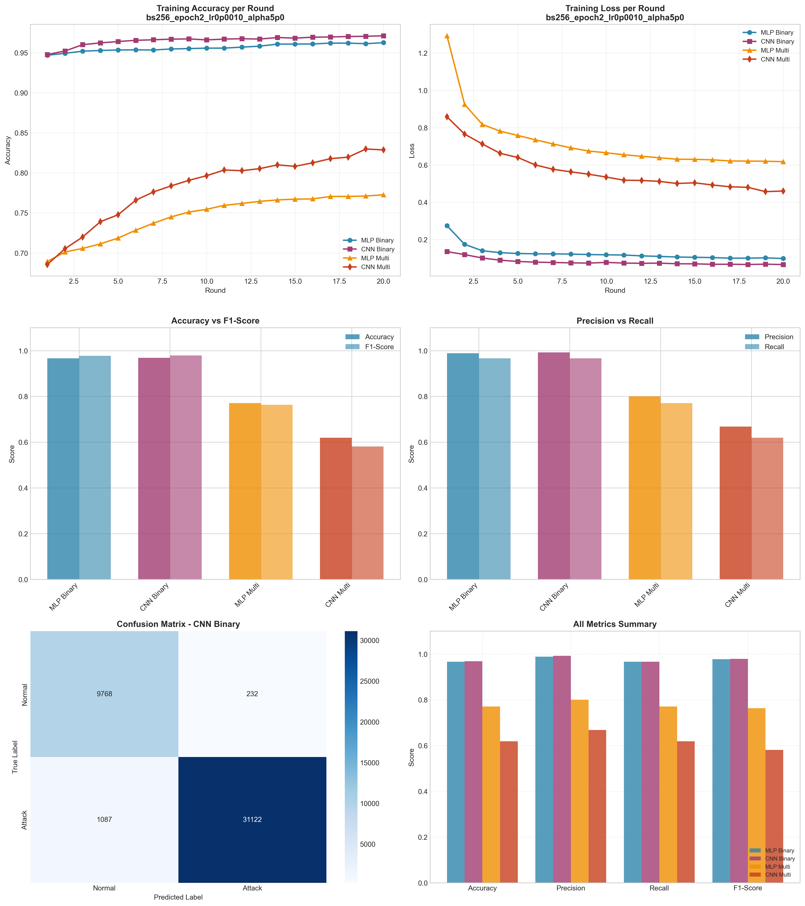

# Experiment Report: bs256_epoch2_lr0p0010_alpha5p0

**Date**: 2025-12-10 08:13:21

## Hyperparameters

- **Batch Size**: 256
- **Local Epochs**: 2
- **Learning Rate**: 0.001
- **Alpha (Dirichlet)**: 5.0
- **Number of Rounds**: 20
- **Number of Clients**: 5

## Results Summary

### Binary Classification

| Model | Accuracy | Precision | Recall | F1-Score | AUC-ROC |
|-------|----------|-----------|--------|----------|----------|
| MLP Binary | 0.9662 | 0.9889 | 0.9665 | 0.9776 | 0.9954 |
| CNN Binary | 0.9688 | 0.9926 | 0.9663 | 0.9792 | 0.9971 |

### Multi-class Classification

| Model | Accuracy | Precision | Recall | F1-Score | AUC-ROC |
|-------|----------|-----------|--------|----------|----------|
| MLP Multi | 0.7709 | 0.8004 | 0.7709 | 0.7637 | 0.9788 |
| CNN Multi | 0.6190 | 0.6678 | 0.6190 | 0.5813 | 0.9231 |

## Training Time

- **MLP Binary**: Total=84.21s, Avg/Round=4.17s
- **CNN Binary**: Total=206.48s, Avg/Round=10.24s
- **MLP Multi**: Total=125.49s, Avg/Round=6.22s
- **CNN Multi**: Total=416.81s, Avg/Round=20.73s

## Visualizations

## Files Generated

- `results_summary.json` - Metrics in JSON format
- `models/` - Saved trained models
- `plots/` - Visualization plots
