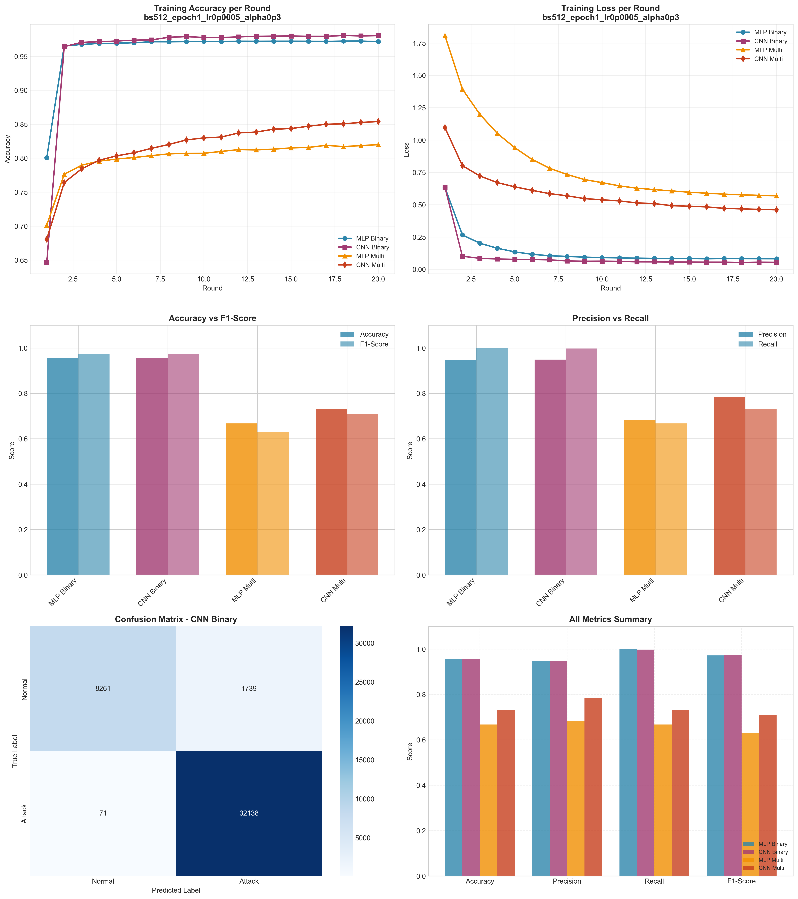

# Experiment Report: bs512_epoch1_lr0p0005_alpha0p3

**Date**: 2025-12-10 09:12:59

## Hyperparameters

- **Batch Size**: 512
- **Local Epochs**: 1
- **Learning Rate**: 0.0005
- **Alpha (Dirichlet)**: 0.3
- **Number of Rounds**: 20
- **Number of Clients**: 5

## Results Summary

### Binary Classification

| Model | Accuracy | Precision | Recall | F1-Score | AUC-ROC |
|-------|----------|-----------|--------|----------|----------|
| MLP Binary | 0.9562 | 0.9474 | 0.9980 | 0.9720 | 0.9933 |
| CNN Binary | 0.9571 | 0.9487 | 0.9978 | 0.9726 | 0.9959 |

### Multi-class Classification

| Model | Accuracy | Precision | Recall | F1-Score | AUC-ROC |
|-------|----------|-----------|--------|----------|----------|
| MLP Multi | 0.6677 | 0.6837 | 0.6677 | 0.6312 | 0.9584 |
| CNN Multi | 0.7327 | 0.7827 | 0.7327 | 0.7099 | 0.9764 |

## Training Time

- **MLP Binary**: Total=60.16s, Avg/Round=2.98s
- **CNN Binary**: Total=144.91s, Avg/Round=7.16s
- **MLP Multi**: Total=81.32s, Avg/Round=4.02s
- **CNN Multi**: Total=302.47s, Avg/Round=14.97s

## Visualizations

## Files Generated

- `results_summary.json` - Metrics in JSON format
- `models/` - Saved trained models
- `plots/` - Visualization plots
