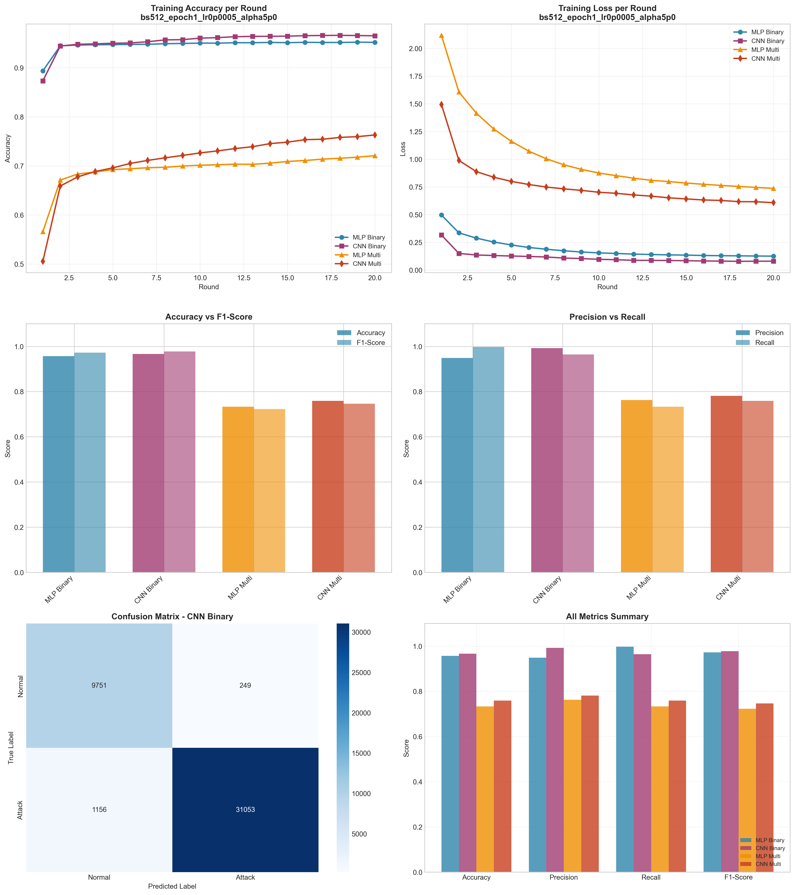

# Experiment Report: bs512_epoch1_lr0p0005_alpha5p0

**Date**: 2025-12-10 09:23:16

## Hyperparameters

- **Batch Size**: 512
- **Local Epochs**: 1
- **Learning Rate**: 0.0005
- **Alpha (Dirichlet)**: 5.0
- **Number of Rounds**: 20
- **Number of Clients**: 5

## Results Summary

### Binary Classification

| Model | Accuracy | Precision | Recall | F1-Score | AUC-ROC |
|-------|----------|-----------|--------|----------|----------|
| MLP Binary | 0.9568 | 0.9487 | 0.9974 | 0.9724 | 0.9935 |
| CNN Binary | 0.9667 | 0.9920 | 0.9641 | 0.9779 | 0.9962 |

### Multi-class Classification

| Model | Accuracy | Precision | Recall | F1-Score | AUC-ROC |
|-------|----------|-----------|--------|----------|----------|
| MLP Multi | 0.7330 | 0.7628 | 0.7330 | 0.7228 | 0.9645 |
| CNN Multi | 0.7588 | 0.7813 | 0.7588 | 0.7461 | 0.9779 |

## Training Time

- **MLP Binary**: Total=58.97s, Avg/Round=2.92s
- **CNN Binary**: Total=148.96s, Avg/Round=7.39s
- **MLP Multi**: Total=83.83s, Avg/Round=4.15s
- **CNN Multi**: Total=308.35s, Avg/Round=15.26s

## Visualizations

## Files Generated

- `results_summary.json` - Metrics in JSON format
- `models/` - Saved trained models
- `plots/` - Visualization plots
