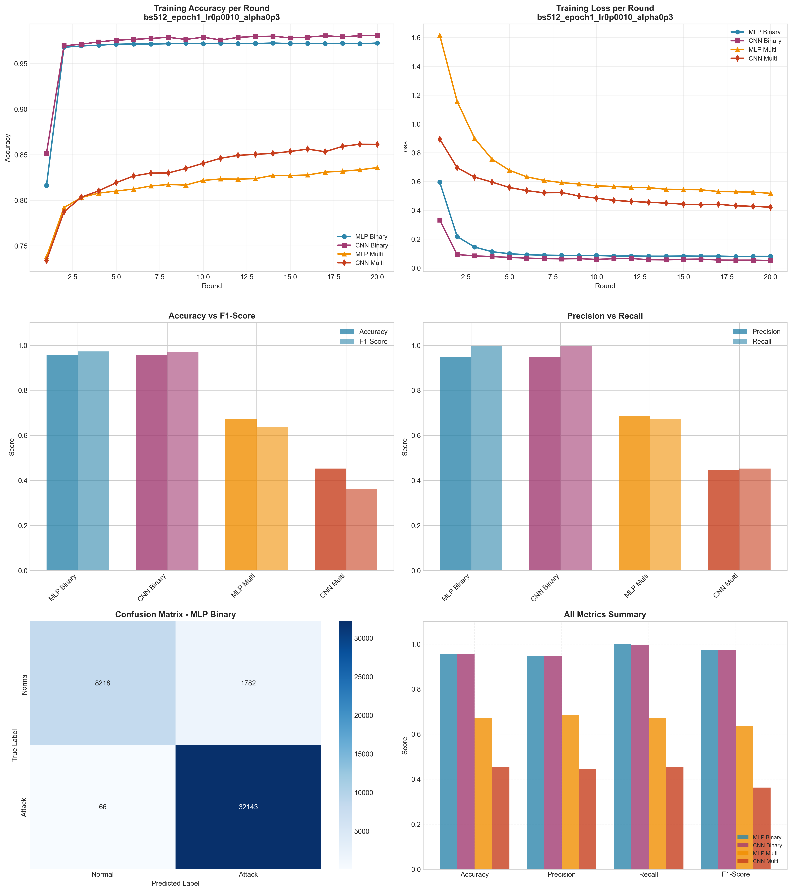

# Experiment Report: bs512_epoch1_lr0p0010_alpha0p3

**Date**: 2025-12-10 08:52:23

## Hyperparameters

- **Batch Size**: 512
- **Local Epochs**: 1
- **Learning Rate**: 0.001
- **Alpha (Dirichlet)**: 0.3
- **Number of Rounds**: 20
- **Number of Clients**: 5

## Results Summary

### Binary Classification

| Model | Accuracy | Precision | Recall | F1-Score | AUC-ROC |
|-------|----------|-----------|--------|----------|----------|
| MLP Binary | 0.9562 | 0.9475 | 0.9980 | 0.9721 | 0.9931 |
| CNN Binary | 0.9560 | 0.9483 | 0.9968 | 0.9719 | 0.9957 |

### Multi-class Classification

| Model | Accuracy | Precision | Recall | F1-Score | AUC-ROC |
|-------|----------|-----------|--------|----------|----------|
| MLP Multi | 0.6723 | 0.6850 | 0.6723 | 0.6357 | 0.9620 |
| CNN Multi | 0.4522 | 0.4449 | 0.4522 | 0.3625 | 0.9336 |

## Training Time

- **MLP Binary**: Total=60.28s, Avg/Round=2.98s
- **CNN Binary**: Total=146.55s, Avg/Round=7.27s
- **MLP Multi**: Total=79.72s, Avg/Round=3.95s
- **CNN Multi**: Total=299.13s, Avg/Round=14.80s

## Visualizations

## Files Generated

- `results_summary.json` - Metrics in JSON format
- `models/` - Saved trained models
- `plots/` - Visualization plots
