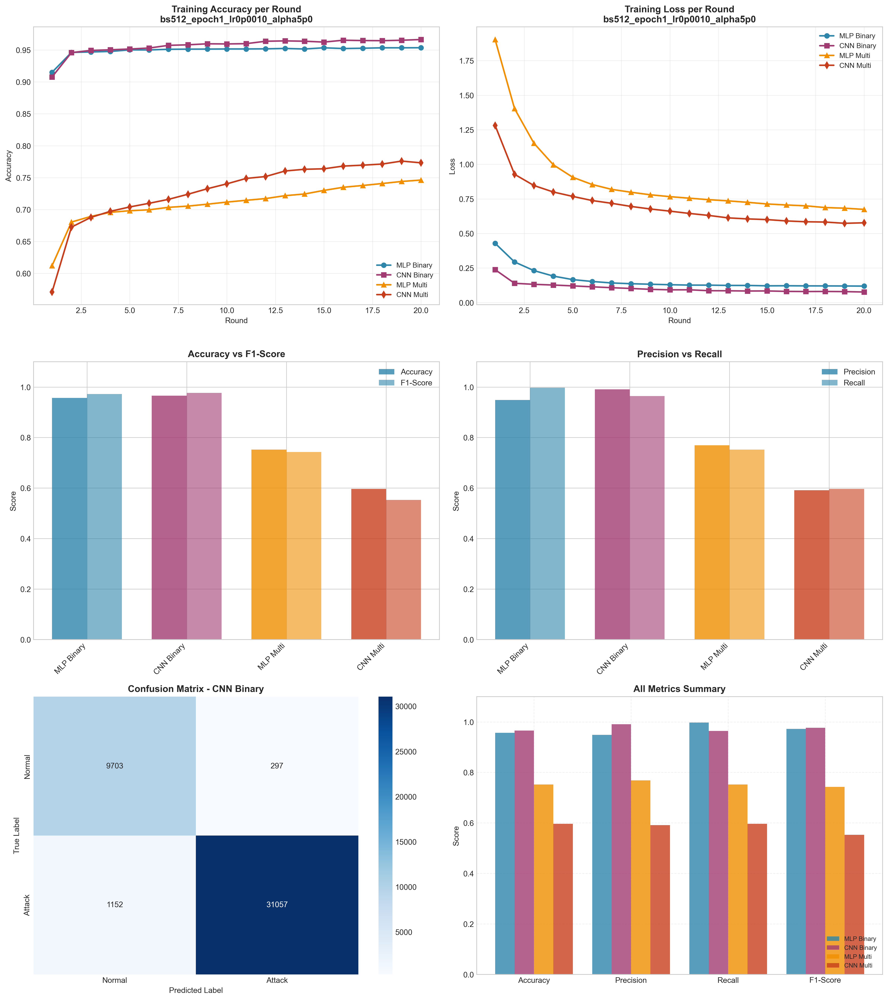

# Experiment Report: bs512_epoch1_lr0p0010_alpha5p0

**Date**: 2025-12-10 09:02:53

## Hyperparameters

- **Batch Size**: 512
- **Local Epochs**: 1
- **Learning Rate**: 0.001
- **Alpha (Dirichlet)**: 5.0
- **Number of Rounds**: 20
- **Number of Clients**: 5

## Results Summary

### Binary Classification

| Model | Accuracy | Precision | Recall | F1-Score | AUC-ROC |
|-------|----------|-----------|--------|----------|----------|
| MLP Binary | 0.9567 | 0.9487 | 0.9972 | 0.9724 | 0.9937 |
| CNN Binary | 0.9657 | 0.9905 | 0.9642 | 0.9772 | 0.9965 |

### Multi-class Classification

| Model | Accuracy | Precision | Recall | F1-Score | AUC-ROC |
|-------|----------|-----------|--------|----------|----------|
| MLP Multi | 0.7524 | 0.7690 | 0.7524 | 0.7428 | 0.9773 |
| CNN Multi | 0.5967 | 0.5917 | 0.5967 | 0.5526 | 0.9423 |

## Training Time

- **MLP Binary**: Total=65.04s, Avg/Round=3.21s
- **CNN Binary**: Total=155.73s, Avg/Round=7.70s
- **MLP Multi**: Total=85.15s, Avg/Round=4.22s
- **CNN Multi**: Total=307.25s, Avg/Round=15.21s

## Visualizations

## Files Generated

- `results_summary.json` - Metrics in JSON format
- `models/` - Saved trained models
- `plots/` - Visualization plots
