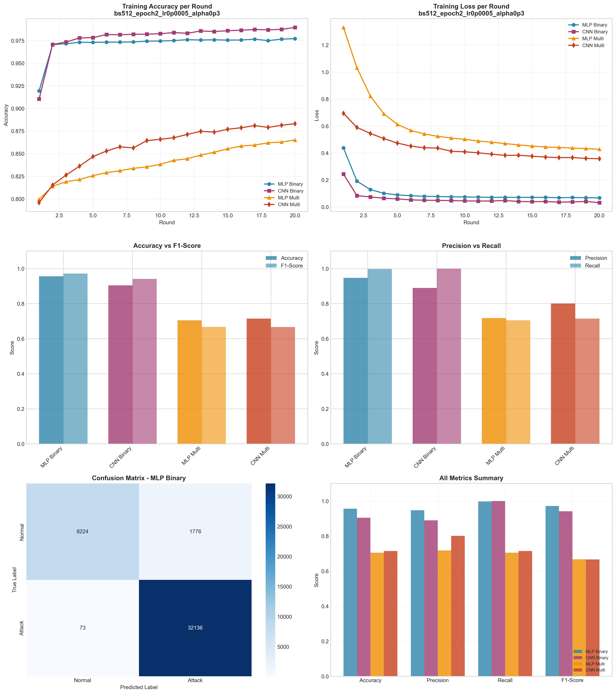

# Experiment Report: bs512_epoch2_lr0p0005_alpha0p3

**Date**: 2025-12-10 10:07:36

## Hyperparameters

- **Batch Size**: 512
- **Local Epochs**: 2
- **Learning Rate**: 0.0005
- **Alpha (Dirichlet)**: 0.3
- **Number of Rounds**: 20
- **Number of Clients**: 5

## Results Summary

### Binary Classification

| Model | Accuracy | Precision | Recall | F1-Score | AUC-ROC |
|-------|----------|-----------|--------|----------|----------|
| MLP Binary | 0.9562 | 0.9476 | 0.9977 | 0.9720 | 0.9943 |
| CNN Binary | 0.9048 | 0.8895 | 0.9994 | 0.9413 | 0.9642 |

### Multi-class Classification

| Model | Accuracy | Precision | Recall | F1-Score | AUC-ROC |
|-------|----------|-----------|--------|----------|----------|
| MLP Multi | 0.7047 | 0.7173 | 0.7047 | 0.6673 | 0.9668 |
| CNN Multi | 0.7146 | 0.8010 | 0.7146 | 0.6668 | 0.9840 |

## Training Time

- **MLP Binary**: Total=77.64s, Avg/Round=3.85s
- **CNN Binary**: Total=221.59s, Avg/Round=10.99s
- **MLP Multi**: Total=112.56s, Avg/Round=5.59s
- **CNN Multi**: Total=470.13s, Avg/Round=23.40s

## Visualizations

## Files Generated

- `results_summary.json` - Metrics in JSON format
- `models/` - Saved trained models
- `plots/` - Visualization plots
