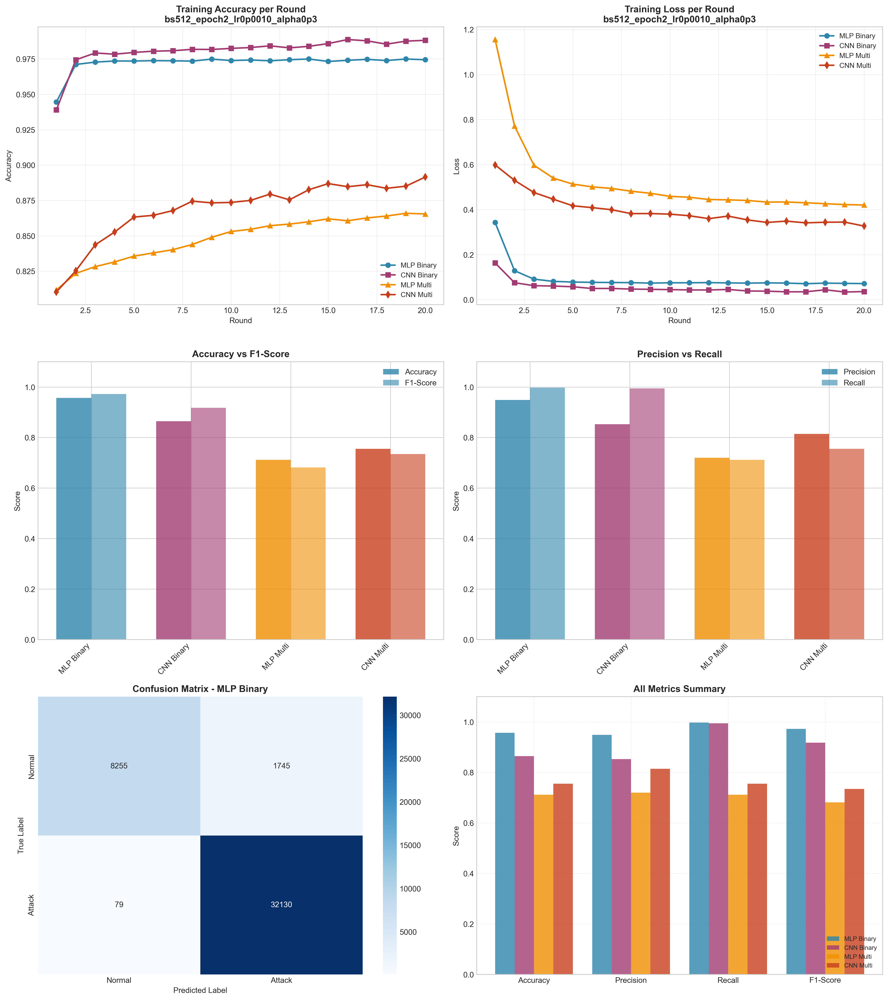

# Experiment Report: bs512_epoch2_lr0p0010_alpha0p3

**Date**: 2025-12-10 09:38:03

## Hyperparameters

- **Batch Size**: 512
- **Local Epochs**: 2
- **Learning Rate**: 0.001
- **Alpha (Dirichlet)**: 0.3
- **Number of Rounds**: 20
- **Number of Clients**: 5

## Results Summary

### Binary Classification

| Model | Accuracy | Precision | Recall | F1-Score | AUC-ROC |
|-------|----------|-----------|--------|----------|----------|
| MLP Binary | 0.9568 | 0.9485 | 0.9975 | 0.9724 | 0.9937 |
| CNN Binary | 0.8644 | 0.8525 | 0.9943 | 0.9180 | 0.9239 |

### Multi-class Classification

| Model | Accuracy | Precision | Recall | F1-Score | AUC-ROC |
|-------|----------|-----------|--------|----------|----------|
| MLP Multi | 0.7118 | 0.7197 | 0.7118 | 0.6814 | 0.9756 |
| CNN Multi | 0.7555 | 0.8145 | 0.7555 | 0.7347 | 0.9699 |

## Training Time

- **MLP Binary**: Total=77.59s, Avg/Round=3.85s
- **CNN Binary**: Total=223.63s, Avg/Round=11.11s
- **MLP Multi**: Total=108.80s, Avg/Round=5.39s
- **CNN Multi**: Total=459.32s, Avg/Round=22.81s

## Visualizations

## Files Generated

- `results_summary.json` - Metrics in JSON format
- `models/` - Saved trained models
- `plots/` - Visualization plots
