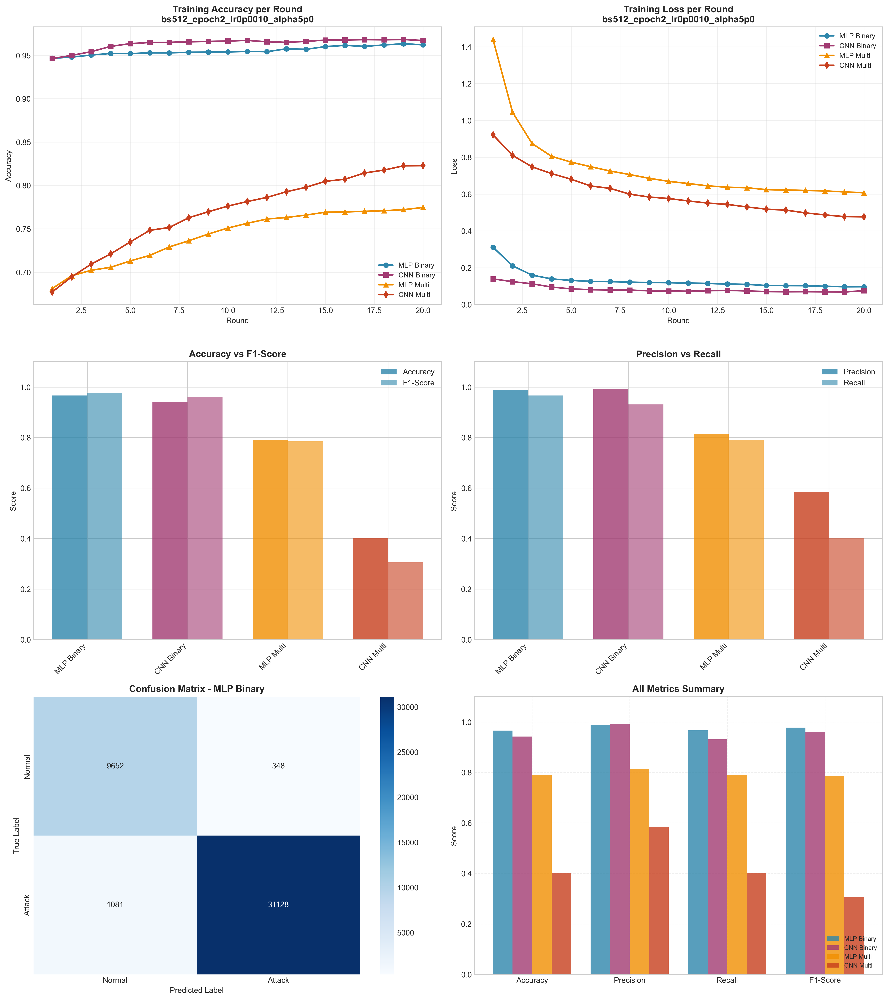

# Experiment Report: bs512_epoch2_lr0p0010_alpha5p0

**Date**: 2025-12-10 09:52:36

## Hyperparameters

- **Batch Size**: 512
- **Local Epochs**: 2
- **Learning Rate**: 0.001
- **Alpha (Dirichlet)**: 5.0
- **Number of Rounds**: 20
- **Number of Clients**: 5

## Results Summary

### Binary Classification

| Model | Accuracy | Precision | Recall | F1-Score | AUC-ROC |
|-------|----------|-----------|--------|----------|----------|
| MLP Binary | 0.9661 | 0.9889 | 0.9664 | 0.9776 | 0.9959 |
| CNN Binary | 0.9421 | 0.9926 | 0.9310 | 0.9608 | 0.9953 |

### Multi-class Classification

| Model | Accuracy | Precision | Recall | F1-Score | AUC-ROC |
|-------|----------|-----------|--------|----------|----------|
| MLP Multi | 0.7905 | 0.8148 | 0.7905 | 0.7846 | 0.9806 |
| CNN Multi | 0.4025 | 0.5855 | 0.4025 | 0.3058 | 0.7132 |

## Training Time

- **MLP Binary**: Total=73.04s, Avg/Round=3.62s
- **CNN Binary**: Total=209.36s, Avg/Round=10.41s
- **MLP Multi**: Total=108.46s, Avg/Round=5.37s
- **CNN Multi**: Total=465.60s, Avg/Round=23.17s

## Visualizations

## Files Generated

- `results_summary.json` - Metrics in JSON format
- `models/` - Saved trained models
- `plots/` - Visualization plots
